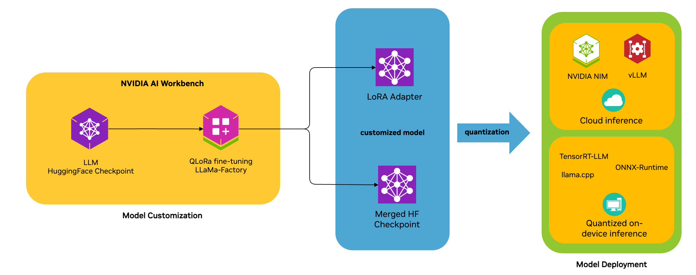

# NVIDIA RTX AI Toolkit
The NVIDIA RTX™ AI Toolkit is a suite of tools and SDKs for Windows application developers to accelerate model customization, optimization, and deployment of AI models into applications running on Windows PC for RTX — across both cloud and PC.

## Latest News
Follow the RTX AI Toolkit fine-tuning workflow with this tutorial - [LLaMaA3-8B QLoRA](tutorial-llama3-finetune.md)

[NVIDIA RTX AI Toolkit Launch Blog](https://developer.nvidia.com/blog/streamline-ai-powered-app-development-with-nvidia-rtx-ai-toolkit-for-windows-rtx-pcs/)

## Getting Started
NVIDIA RTX AI Toolkit includes 2 primary phases: Model Customization and Model Deployment. Each phase is tailored to guide you through the necessary steps to effectively customize and deploy your AI models.

Currently, we support an end-to-end workflow for customizing LLMs using PEFT (Parameter Efficient Fine-Tuning) techniques such as LoRA and(Low-Rank Adaptation of Large Language Models) and QLoRA on your RTX PC and deploying using NVIDIA TensorRT-LLM, ONNX-Runtime, llama.cpp, or as NIM endpoints in the cloud.

### 1. Model Customization  - [TUTORIAL](tutorial-llama3-finetune.md): 
The model customization tutorial walks you through launching AI Workbench, using the LlamaFactory GUI to do QLoRa fine-tuning, and exporting the quantized model. Optionally, we provide Jupyter notebooks for quantizing finetuned models for deployment with TensorRT-LLM.

### 2. Model Deployment - [START HERE](llm-deployment/README.md)
There are two paths to deploy AI models: On device, or in cloud. Models deployed to device can achieve lower latency and don't require calls to the cloud at runtime, but have certain hardware requirements. Models deployed to the cloud can support an application running on any hardware, but have an ongoing operating cost. Different applications will do either, or both. The RTX AI Toolkit provides tools for both paths, and we provide instructions in the tutorial for deploying across on device and cloud environments.

NVIDIA AI Inference Manager (AIM) SDK offers developers a unified interface to orchestrate deployment of AI models across devices using multiple inference backends -  from cloud to local PC execution environments. This is currently available to certain early access customers, [apply now](https://developer.nvidia.com/rtx/ai-inference-manager/join) to get access.

**Quantized (on-device) inference:**
For on-device inferencing the we below inferencing paths are supported:
| Platform | LoRA Adapter | Merged checkpoint |
| -------- | :------------------: | :-----------------------: |
| TensorRT-LLM |[✅](llm-deployment/TensorRT-LLM-LoRA-deployment.md) |  [✅](llm-deployment/TensorRT-LLM_deployment.md) |
| llama.cpp |   |   [✅](llm-deployment/llama.cpp_deployment.md) |
| ONNX Runtime - DML |     |   [✅](llm-deployment/ORT-DML_QuickStart.md) |

**FP16 (cloud) inference:**
For cloud deployments the following inferencing paths are supported:
| Platform | LoRA Adapter | Merged checkpoint |
| -------- | :------------------: | :-----------------------: |
| vLLM |    [✅](llm-deployment/vLLM_deployment.md#3-serving-lora-adapters) |   [✅](llm-deployment/vLLM_deployment.md) |
| NIMs| [✅](llm-deployment/NIMs_deployment.md)    |    |

## Reference Projects
1. [AI Workbench LLaMa-Factory Project](https://github.com/NVIDIA/workbench-llamafactory)
2. [ChatRTX - Reference RAG Demo](https://github.com/NVIDIA/ChatRTX)
3. [OpenAI Compatible Web Server](https://github.com/NVIDIA/trt-llm-as-openai-windows)
4. [Projects built by the community](https://www.nvidia.com/en-us/ai-data-science/generative-ai/rtx-developer-contest/winners/)

## Support
Please file Issues on GitHub.  

## License
This repository is licensed under the [Apache-2.0 License](LICENSE).

