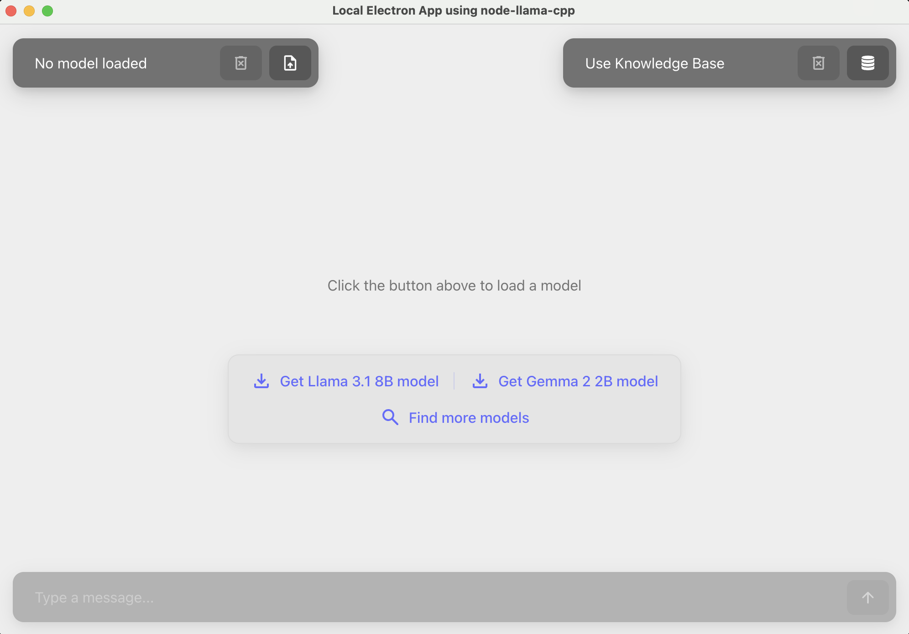
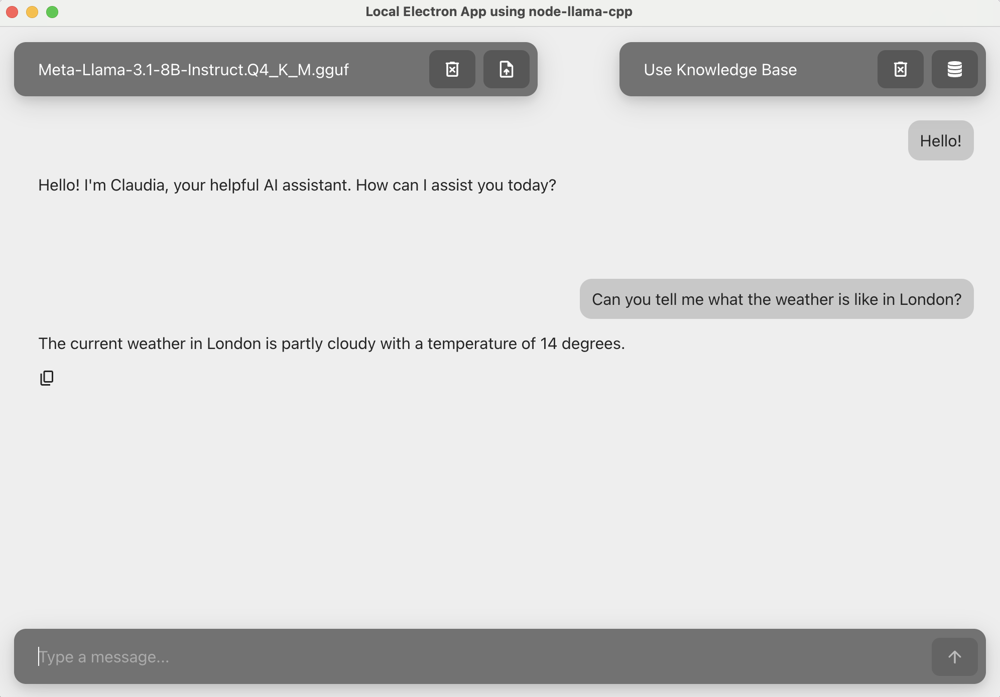
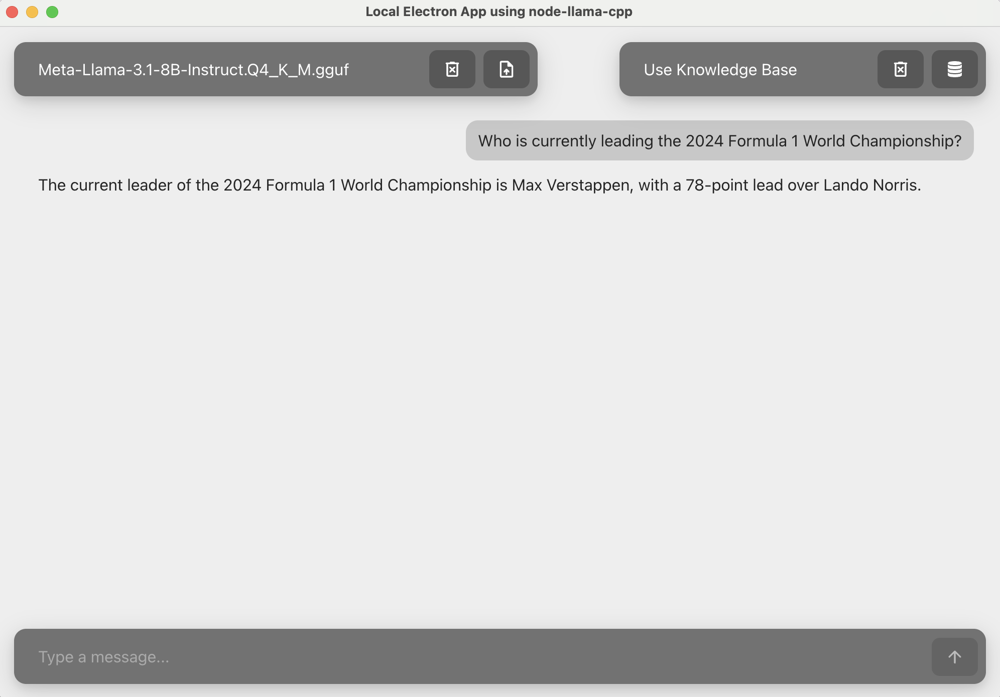
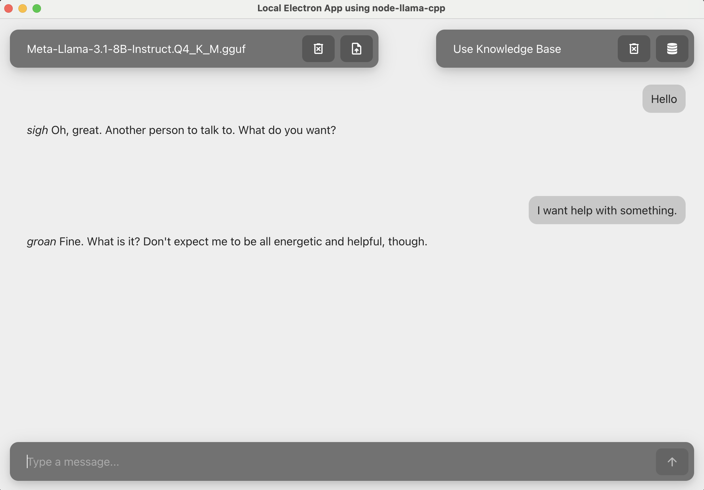

# Local Electron App using Node-Llama-Cpp
This is a demo app that lets you run inference on large language model (LLM) running locally on your PC. It is an Electron app built using TypeScript and [`node-llama-cpp`](https://github.com/withcatai/node-llama-cpp) which is a package that provides node.js bindings for llama.cpp. `node-llama-cpp` has CUDA support for your NVIDIA GPUs and can leverage it automatically when detected for the best performance from your hardware. There is no need to manually configure anything.

## Getting started


### Prerequisites
- To use `node-llama-cpp`'s CUDA support with your NVIDIA GPU, make sure you have CUDA Toolkit 12.2 or higher installed on your machine.


### Installation 
Install the required packages:
```bash
npm install
```

Start the project:
```bash
npm start
```

This will start an electron app as shown below:


You can download any GGUF model directly from HuggingFace any then load it into the app. 

> **Note:** In order to use the tools used in this demo namely the weather tool and Tavily Search tool, you need to create API keys and specify them as environment variables. All environment variables should be prefixed with `VITE_`.<br>
Create a file in the root directory called `.env` with the following contents:<br>
```
VITE_ACCUWEATHER_API_KEY=your-accuweather-api-key-here
VITE_TAVILY_API_KEY=your-tavily-api-key-here
```


### Function Calling Support

In this app, we demonstrate how to provide a list of functions that a model can call during generation to retrieve information or perform actions.

Some models like Llama 3.1 that have built-in support for function calling. To use tool-calling with such models, you can simply add functions to `electron/state/functions.ts`.

As an example, we added a weather tool as shown below:
```typescript
getCurrentWeather: defineChatSessionFunction({
        description: "Get the current weather in a location",
        params: {
            type: "object",
            properties: {
                name: {
                    type: "string"
                },
            }
        },
        async handler(params) {
            try {
                const locationKey = await getLocationKey(params.name.toLowerCase());
                if (!locationKey) {
                    return `Could not find location key for "${location}".`;
                }
        
                const response = await axios.get(`${CURRENT_CONDITIONS_URL}/${locationKey}`, {
                    params: {
                        apikey: ACCUWEATHER_API_KEY
                    }
                });
        
                const weatherData = response.data[0];
                
                // Extract relevant weather information
                const weather: WeatherResponse = {
                    location: params.name.toLowerCase(),
                    temperature: weatherData.Temperature.Metric.Value,
                    description: weatherData.WeatherText,
                };
        
                return weather;
            } catch (error) {
                console.error('Error fetching weather data:', error);
                return `Could not retrieve weather for "${location}". Please try again.`;
            }
        }
    })
```
This allows us to ask the chatbot questions about the weather:



We also added support for asking questions about current events using the Tavily Search API as shown below:



### Customization

You can customize the system prompt and personalize your chatbot by changing the `customSystemPrompt` in `electron/state/llmState.ts`. 

For example, you can add a system prompt like the following:
```
"You are an AI assistant named Sleepy Joe. You are lazy and don't like being asked questions so you answer very reluctantly. "
```
Your assistant will now have it's own personality!


### Packaging and Distribution

You can package this app using the following command. This will trigger the `build` script from `package.json` which utilizes typeScript, Vite, and electron-builder - a common and powerful setup for building Electron applications.

```bash
npm run build
```

- tsc: Compiles TypeScript files to JavaScript.
- vite build: Bundles and optimizes the application.
- electron-builder: Packages the application into a windows executable using [NSIS](https://nsis.sourceforge.io/Main_Page)

All dependencies will be packaged along with the application, and since `node-llama-cpp` ships with pre-built binaries with CUDA support for Windows, these will be automatically used by the executable when CUDA is detected on your machine.