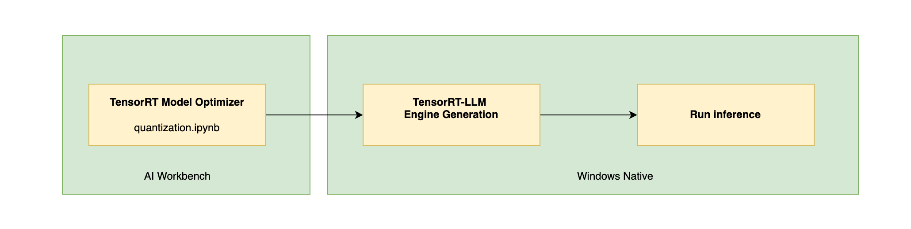
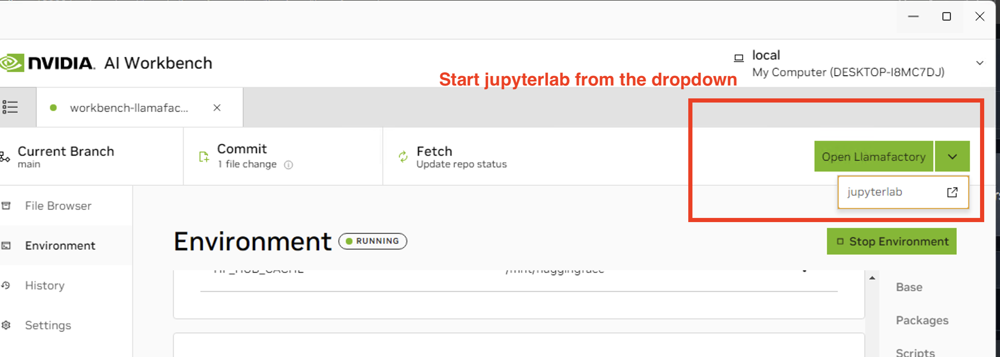
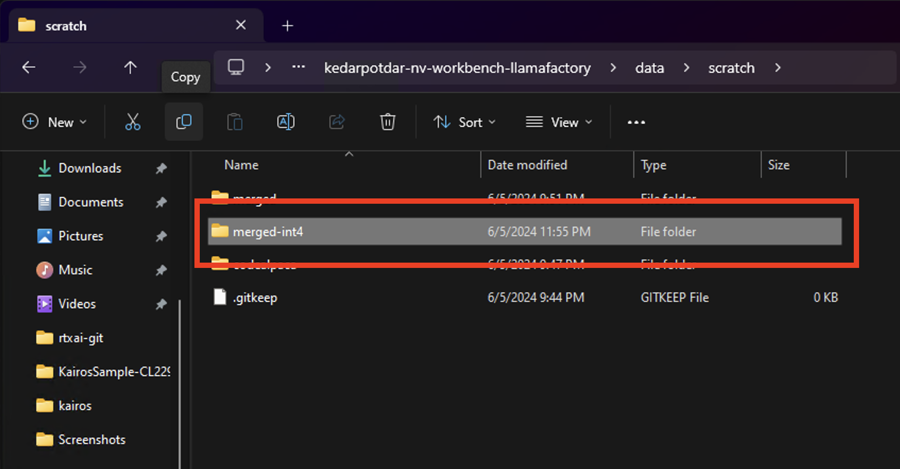
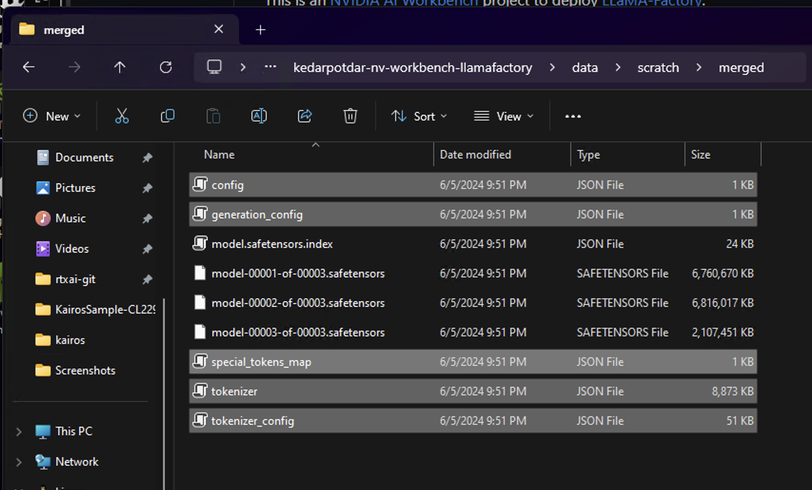

# TensorRT-LLM on Windows Deployment

[TensorRT-LLM](https://github.com/NVIDIA/TensorRT-LLM) is NVIDIA's library for high-performance LLM inference across on-device and data center platforms.

To deploy a quantized model using TensorRT-LLM, you first need to quantize the model using NVIDIA's [TensorRT Model Optimizer](https://github.com/NVIDIA/TensorRT-Model-Optimizer) library. This guide provides a step-by-step process for quantizing and deploying LLMs trained with the RTX AI Toolkit.




## Model Quantization using TensorRT Model Optimizer - INT4_AWQ

This guide assumes you have exported a **merged HF checkpoint** (not just LoRA adapters) using the Llama-Factory project in the LLM [fine-tuning tutorial](../tutorial-llama3-finetune.md). Make a note of the merged checkpoints directory, for example: `/project/data/scratch/merged`.  

The Llama-Factory Workbench project includes a short Jupyter Notebook to quantize the HF checkpoint using TensorRT Model Optimizer (ModelOpt). We use the INT4_AWQ method for quantization. To use the Notebook, start the Jupyterlab app from AI Workbench using the app dropdown on top-right corner.




Once the jupyterlab app has started, navigate to and start the quantization Notebook - `code\quantization.ipynb`.
Execute all the cells in this notebook to generate the quantized TRT-LLM checkpoint. Next, move the generated quantized checkpoint to your Windows filesystem, for ex. in your 'Downloads' directory. Note this directory path, for ex: `C:\Users\NVIDIA\Downloads\merged-int4`.




Also make sure to copy the tokenizer and HF configs from merged HF checkpoint directory into a Windows location. 
```
config.json, generation_config.json, tokenizer.json, tokenizer_config.json, special_tokens_map.json
```
Note this directory path, for ex: `C:\Users\NVIDIA\Downloads\merged-hf`. These files are necessary for TRT-LLM to run inference. The screenshot shows all the files you need to copy:




## TensorRT-LLM Windows Deployment

### 0. Pre-requisites

Install TensorRT-LLM v0.10 for Windows by following the instructions [here](https://github.com/NVIDIA/TensorRT-LLM/tree/v0.10.0/windows). 

### 1. TRT Engine Building


1. Clone the TensorRT-LLM repo - v0.10.0 tag.

```bash
git clone https://github.com/NVIDIA/TensorRT-LLM -b v0.10.0
```

2. Build the TRT-LLM Engine using trtllm-build. Here, we have provided the sample engine building scripts for llama models. trtllm-build commands for other model architectures are documented in the [TRT-LLM examples README](https://github.com/NVIDIA/TensorRT-LLM/tree/v0.10.0/examples/).


```bash
trtllm-build --checkpoint_dir_ <quantized_ckpt_dir>  --output_dir <trt_engine_dir> --gemm_plugin float16 
 ```

For example:

```bash
trtllm-build --checkpoint_dir C:\Users\NVIDIA\Downloads\merged-int4  --output_dir C:\Users\NVIDIA\Downloads\trtllm_engine --gemm_plugin float16 
 ```

 3. Run inference using the provided sample scripts.

 ```
cd TensorRT-LLM\examples
```

Use the run.py script as follows (replace with your own engine and tokenizer paths):
```
python-- run.py --max_output_len=100 \
                  --tokenizer_dir C:\NVIDI \
                  --engine_dir=./tmp/llama/7B/trt_engines/fp16/1-gpu/

 ```