# RTX AI Toolkit LLM Customization Tutorial  

In this tutorial, you'll learn how to use the LLaMA-Factory NVIDIA AI Workbench project to fine-tune the Llama3-8B model on a RTX Windows PC. First, we showcase the QLoRA technique for model customization and explain how to export the LoRA adapter or the fine-tuned Llama-3 checkpoint.

## 0. Prerequisites 
1. Ensure you have a Windows PC equipped with an RTX GPU, ideally with at least 16GB of VRAM (GeForce RTX 4070Ti or higher). 
2. Download and install [NVIDIA AI Workbench](https://www.nvidia.com/en-us/deep-learning-ai/solutions/data-science/workbench/)** for local AI development. This project is built for the latest (May 2024) release - v0.50.16.

3. Generate a HuggingFace [User Access Token](https://huggingface.co/docs/hub/en/security-tokens). Ensure your HuggingFace account has access to the Meta Llama3-8B-Instruct model [here](https://huggingface.co/meta-llama/Meta-Llama-3-8B-Instruct). 

4. 100+ GB free disk space to store the AI Workbench containers, and LLM checkpoints. 

## 1. Setup LLaMa-Factory Workbench Project

1. Start AI Workbench on your Windows PC and select 'Clone Project'. Proceed to clone the LLaMa-Factory Workbench project using this GitHub URL: [https://github.com/kedarpotdar-nv/workbench-llamafactory](https://github.com/kedarpotdar-nv/workbench-llamafactory)

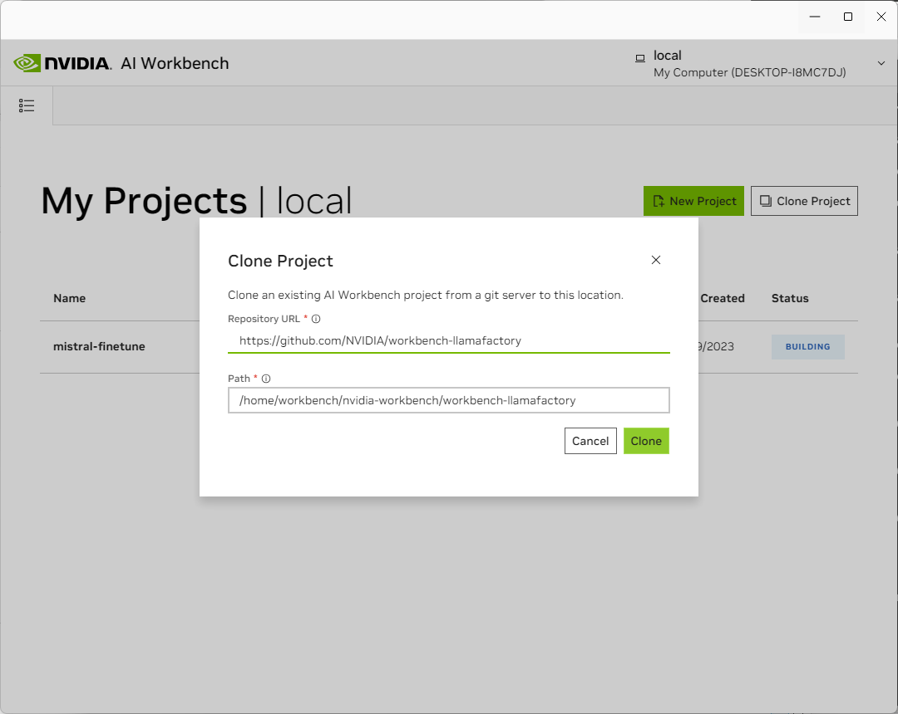

2. After the repo is downloaded, AI Workbench will start building the project on your PC. This step may take 10-15 minutes depending on your network speed. 

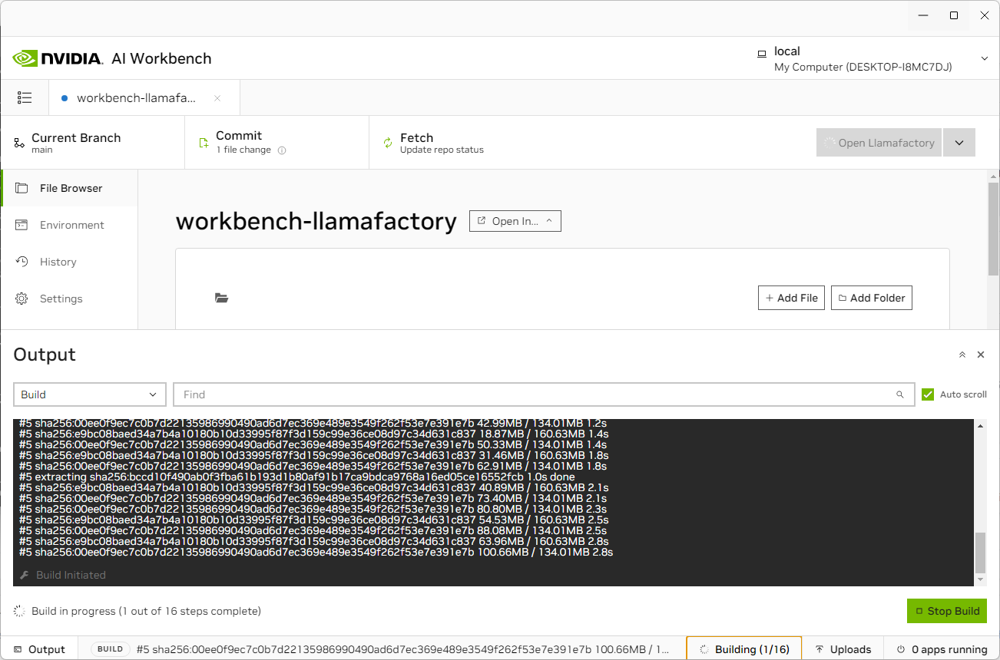

3. Once the build is complete, your Workbench project is ready for use.

>[!TIP]
> NVIDIA AI Workbench configures a WSL2 distribution (named NVIDIA-Workbench) on your Windows PC and creates a Docker/Podman container for each project. By default, the local project workspace is mounted at `/project/` within the container, and its contents can be accessed through the Workbench GUI's File Browser. The directories shown in the Workbench project, like 'data', correspond to paths within the containers as `/project/data`. Make sure to store any generated assets, such as model checkpoints, in directories within the `/project/` path to ensure they are preserved between sessions.

## 2. Using LLaMa-Factory for parameter-efficient fine-tuning of Llama3-8B

1. **Start LLaMa-Factory from AI Workbench.**

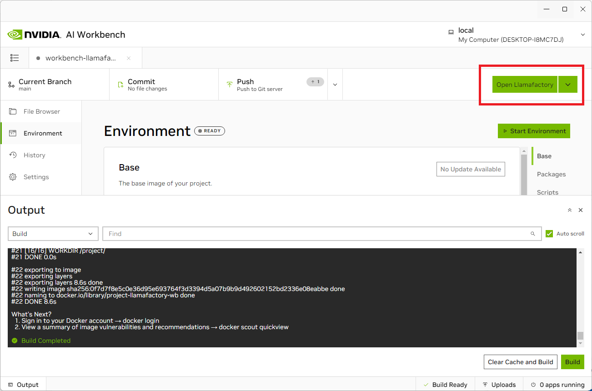

Upon starting the project for the first time, AI Workbench will prompt for your HuggingFace Token.

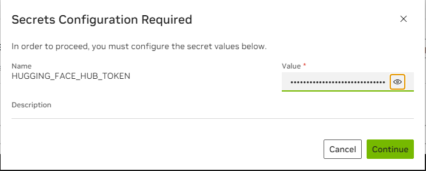

The LLaMa-Factory GUI should now start in your web browser.

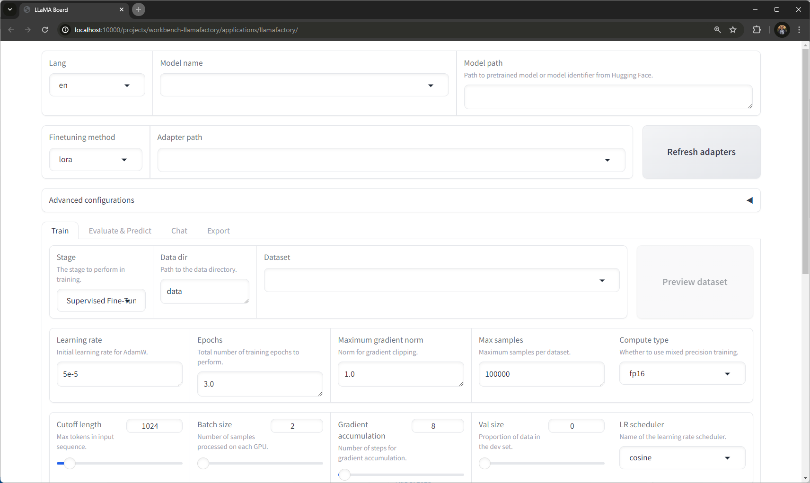

2. **Model Training Configuration**

In the Model Name dropdown, select 'LLaMA3-8B-Chat' as the model you wish to fine-tune. Ensure that the fine-tuning method is set to 'lora' and leave the adapter path empty for the time being.

Next, expand the 'Advanced Configuration' section and set the 'Quantization bit' dropdown to '4'. This setting is crucial to perform QLoRA fine-tuning.

Llama-Factory offers a variety of built-in datasets suitable for fine-tuning. For this tutorial, we will be using the [codealpaca dataset](https://huggingface.co/datasets/sahil2801/CodeAlpaca-20k) provided by sahil2801.  

To fine-tune using a custom dataset, go to [Appendix: Importing Custom Datasets](#appendix-importing-custom-datasets).

Next, in the 'train' tab, let's select the dataset and training parameters. 

| Parameter      | Value |
| ----------- | ----------- |
| Lang      | en       |
| Model name   | LLaMA3-8B-Chat        |
| Finetuning method | lora |
| Advanced Config > Quantization bit | 4 |
| Advanced Config > Prompt template | llama3 |
| Train >  Stage | Supervised Fine-Tuning |
| Train > Data dir | data |
| Train > Dataset | codealpaca |

Hyperparameters:

| Hyperparameter | Value |
| -------------- | ----- |
| Learning rate | 2.5e-5 |
| Max samples | 5000 |
| Epochs | 3.0 |
| Batch size | 2 |

Adjust the hyperparameters above, based on your setup. Keep all other configurations at their default values. The codealpaca dataset contains approximately 20,000 samples; however, for this tutorial, we are limiting it to 5,000 samples to accelerate the training process. 

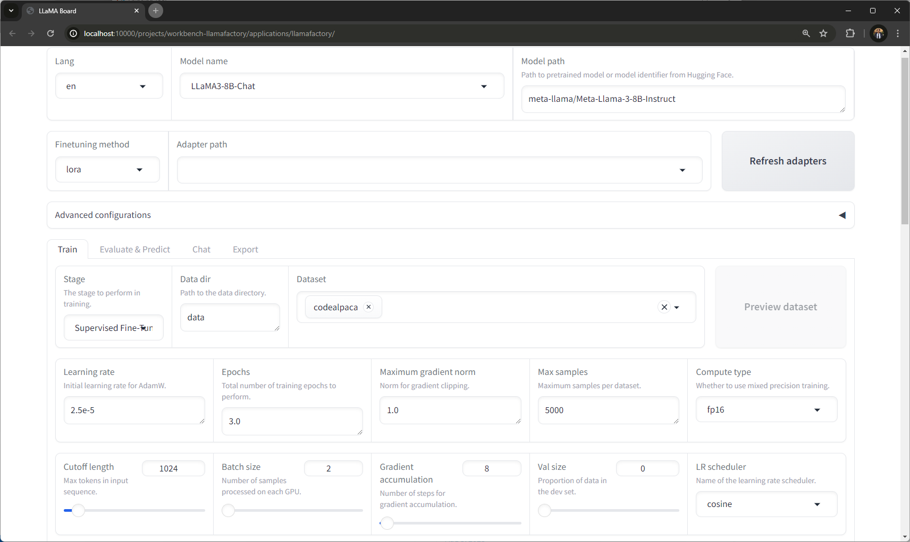

By default, LLaMA-Factory only trains the `q_proj`, and `v_proj` LoRA modules. To improve accuracy, we recommend fine-tuning LoRA modules. Expand the 'LoRA Configurations' tab, and specify the below as 'LoRA modules':

`q_proj, k_proj, v_proj, gate_proj, up_proj, down_proj, lm_head`

>[!IMP] Ensure that the output directory is under `/project/data/scratch/`.

| Parameter | Value |
| -------------- | ----- |
| Output dir | /project/data/scratch/codealpaca |
| Config path | /project/data/scratch/config |

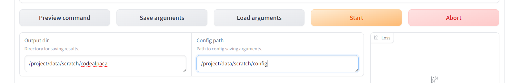

Next, scroll down to the relevant section to preview the command LlamaFactory will use to initiate training. Make sure that the training data is stored in the specified locations as indicated in the tutorial. This ensures that the data is correctly accessed by the training process.

Training is expected to take about 30 minutes on an RTX 4090 with these parameters. To improve accuracy of the trained model, you can increase the max samples and number of epochs. This will increase the time required for training.

After you have ensured that the output and project directories are set to the recommended paths, press 'Start' to kick-off the fine-tuning process.

Once the model training begins, you will be able to see the loss function plot within the LLaMa-Factory GUI. Detailed logs will also be displayed alongside the plot, providing insights into the training progress.
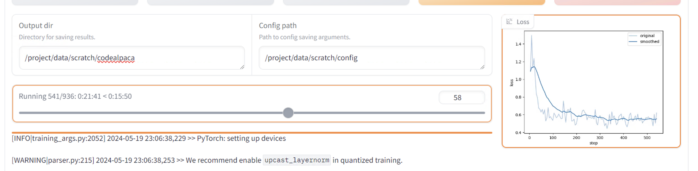

The application stores model checkpoints every 100 steps in the data/scratch/codealpaca directory. Navigate to this directory inside the Windows Explorer:

1. Open the Workbench Project Settings tab.
2. Next, click on the 'Open' icon next to the project path as shown below:
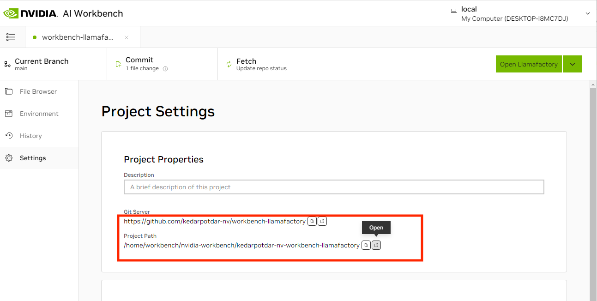

3. This action will open a File Explorer window. Navigate to the `data > scratch > codealpaca` directory to view the checkpoints during the fine-tuning process. Once complete, you will find the final LoRA adapters in this directory.
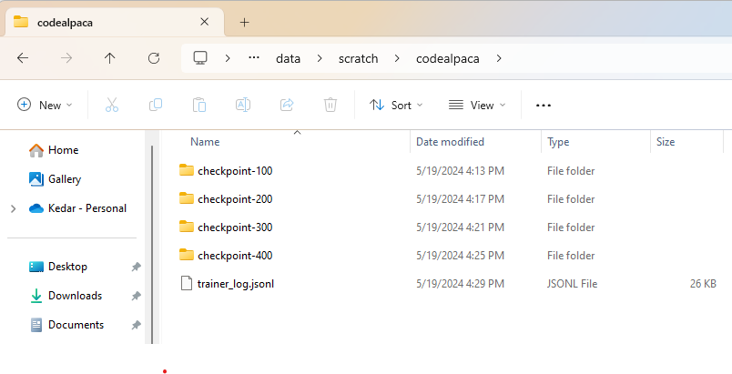

## 3. Evaluating Model

Once the fine-tuning process is complete, the final adapters will be available in the data/scratch/codealpaca directory. 
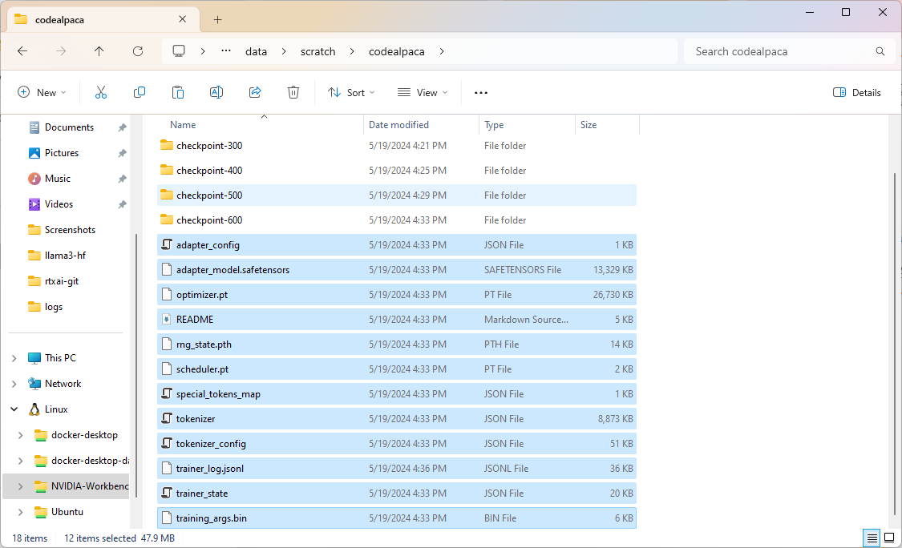

To evaluate the model, return to the LLaMa-Factory GUI and open the 'Chat' tab. In the adapter path, specify the directory where your LoRA adapters are stored. In this case, that is `/project/data/scratch/codealpaca`. Then, click on 'Load Model' to start chatting. 

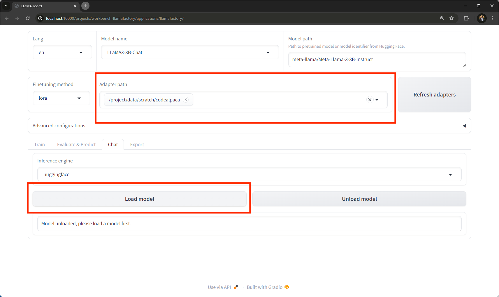

After the model is loaded in VRAM, chat with the model by providing a system prompt and user prompt.

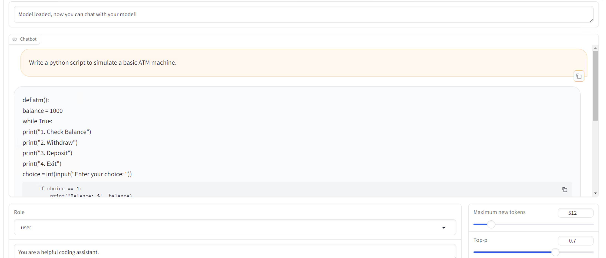

You have the option to continue training the model by selecting the 'adapter path' in LLaMa-Factory before initiating fine-tuning again. This allows you to further refine the same adapter, enhancing its performance.

## 4. Model Export

RTX AI Toolkit offers two options for exporting the model customized using the LLama-Factory project:

1. **LoRA Adapter Export:** Export only the adapter layers that have been modified or added during the fine-tuning process, enabling easy integration with other projects, further customization, or deployment with libraries that support runtime LoRA adapters such as vLLM.
   
2. **Merged Checkpoint Export:** Export the entire model, including both the original pre-trained layers and the newly added LoRA adapters, creating a fully integrated and deployable version of the model.

### LoRA Adapter Export
Exporting LoRA adapters is a straightforward process. Simply copy the adapter files from the output directory located at `data/scratch/codealpaca`. This method allows for easy retrieval and use of the adapters in different projects or environments. Copy the files highlighted below:

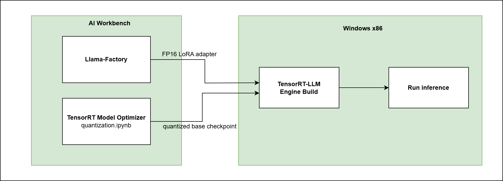

### Merged Checkpoint Export
To export a merged LLaMA3-8B checkpoint, return to the LLaMa-Factory GUI in your web browser. Make sure the correct model and adapter directory are selected (`/project/data/scratch/codealpaca`). Choose an appropriate maximum shard size, for example, 5GB, to ensure the exported file is manageable. Set the export device to GPU to leverage faster processing, and specify the project directory to a mounted directory such as `/project/data/scratch/merged`. Finally, click on the 'Export' button to initiate the export process. This will generate a complete model file that includes both the original model and the fine-tuned adaptations. 

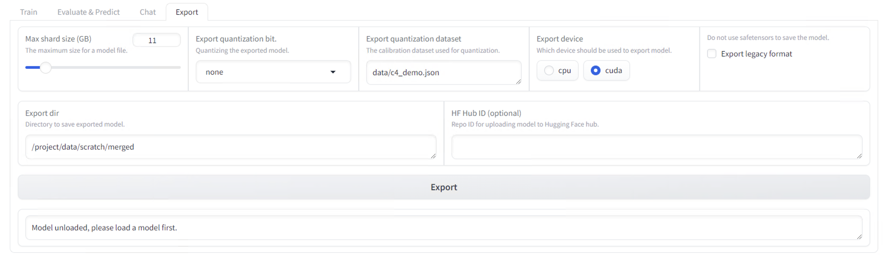

Once exported, the merged checkpoint will be available in the `data/scratch/merged` directory. You can then copy the `merged` directory to your local filesystem for further use. Alternatively, you can export the checkpoint directly to HuggingFace using the built-in uploader provided in LlamaFactory, facilitating easy sharing and deployment through the HuggingFace platform.

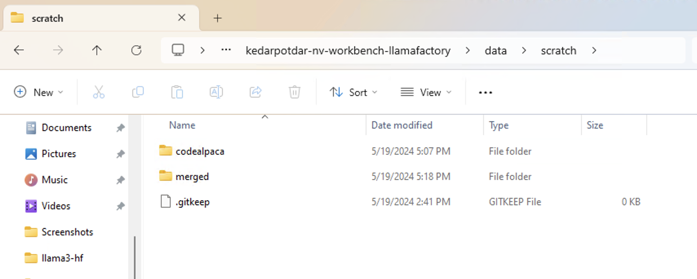

## 5. Model Deployment

RTX AI Toolkit supports the following options for inference deployment of LLMs.

[!NOTE] Click on the ✅ for instructions for that particular pathway.

**Quantized (on-device) inference:**
| Platform | LoRA Adapter | Merged checkpoint |
| -------- | :------------------: | :-----------------------: |
| TensorRT-LLM | |  [✅](llm-deployment/TensorRT-LLM_deployment.md) |
| llama.cpp |    |   [✅](llm-deployment/llama.cpp_deployment.md) |
| ONNX Runtime - DML |     |   [✅](llm-deployment/ORT-DML_QuickStart.md) |

**FP16 (cloud) inference:**
| Platform | LoRA Adapter | Merged checkpoint |
| -------- | :------------------: | :-----------------------: |
| vLLM |    ✅ |   ✅ |
| NIMs| ✅    |    |

## Appendix - Importing custom datasets

LLaMA-Factory supports datasets in the **alpaca** and **sharegpt** format. Read more about custom datasets [here](https://github.com/hiyouga/LLaMA-Factory/tree/main/data).

To incorporate a custom training dataset into your LLama-Factory AI Workbench project, you can follow these steps using the GPTeacher/Roleplay dataset as an example:

1. Download the Dataset:

- Navigate to the GPTeacher GitHub repository at GPTeacher Roleplay Dataset.
- Download the file `roleplay-simple-deduped-roleplay-instruct.json`.

2. Move the Dataset File:

- Transfer the downloaded file to your data directory where dataset_info.json is located. This directory is accessible inside the container at `/project/data`.
- Update dataset_info.json:

3. Edit the dataset_info.json file to include the new dataset by adding the following entry:

<pre>
{
  "roleplay_alpaca": {
    "file_name": "roleplay-simple-deduped-roleplay-instruct.json",
    "formatting": "alpaca",
     "columns": {
      "system": "instruction",
      "prompt": "input",
      "response": "response"
    }
  }
}
</pre>

4. Navigate to LLaMa-Factory GUI and select the Directory as `/project/data`, the `roleplay_alpaca` dataset should be available in the dropdown.
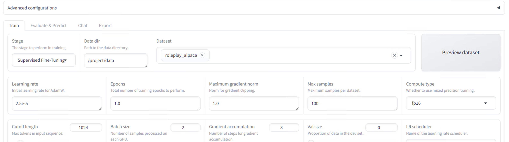

Proceed to fine-tune as usual.

## Troubleshooting Guide

### 1. Access logs in AI Workbench 
To access the application's logs in Workbench, click on the 'Output' button at the bottom of the Workbench desktop app to expand the Logs widget. And then select 'LLaMa-factory' app from the dropdown.

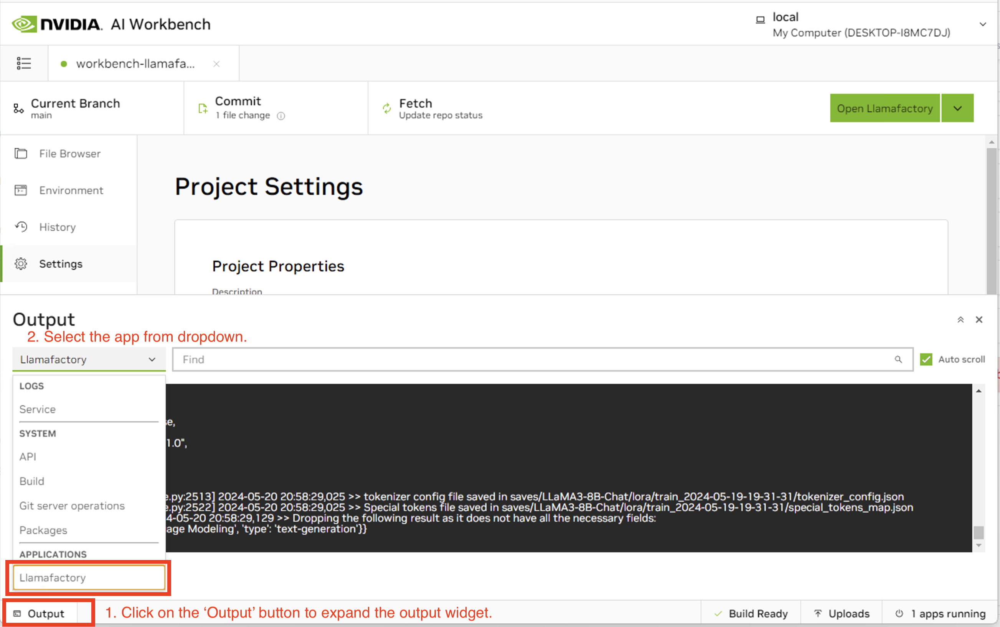

### 2. Access Llamafactory Python Environment

LLaMa-Factory is installed inside a 

### 3. Workbench Project Build error
Sometimes when upgrading Workbench version, 

### 4. Upgrading Workbench 

To upgrade Workbench

<TODO>
